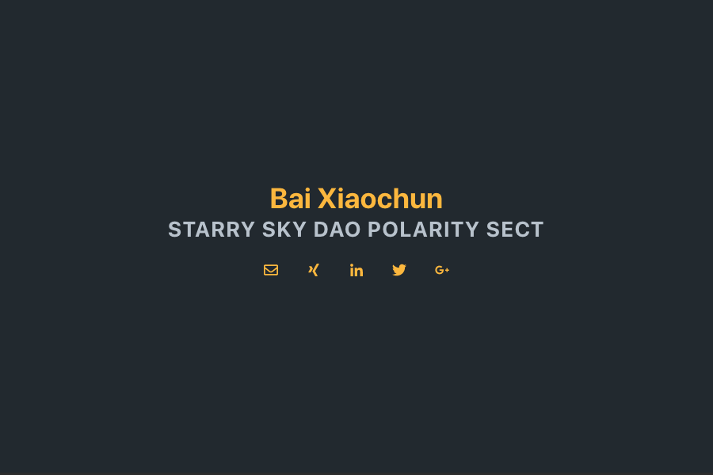

# Theme center for Hugo

A simple single page theme for the open-source static site generator [Hugo](https://gohugo.io/)



## Installation

    git clone git@github.com:MIKAGMR/hugo-center.git themes/hugo-center
    


## Settings
Look into the ```_config.toml``` file in the theme directory and copy the ```params``` section into your ```config.toml``` file.

Turn off sitemap and RSS generation in the ```config.toml``` file:

    disableKinds= ["sitemap", "RSS"]

Enable/disable inline CSS and the social icons in the footer:

    [params.enable]
        inlineCSS = true        # Write the CSS in a style tag or use a link tag
        iconsInFooter = false   # Show icons in footer or below the subtitle

Enable the mail icon:

    [[params.contact.info]]
        name = "Email"
        icon = "envelope"
        link = "mailto:<youremail@address>"

Enable the required social icons. For example:

    [[params.contact.social]]
        name = "Twitter"
        icon = "twitter"
        link = "//twitter.com/<yourprofilename>"

## Developing hugo-center

In order to develop or make changes to the theme you will need to have all the node packages installed.

Change to the ```theme/hugo-center``` directory and use ```npm install``` via command-line to install the dependencies in the local node_modules folder.

The theme use 
+ [Tailwind CSS](https://tailwindcss.com/)
+ [PostCSS](http://postcss.org/)
+ [Purgecss](https://www.purgecss.com/)

The configuration files are in the theme folder and the postcss files are in the ```src``` folder.


### Development build

Use ```npm start``` to build the css.

### Production Build

Use ```npm run build``` to build, minify and purge the css.
